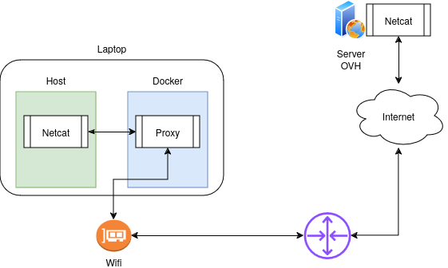
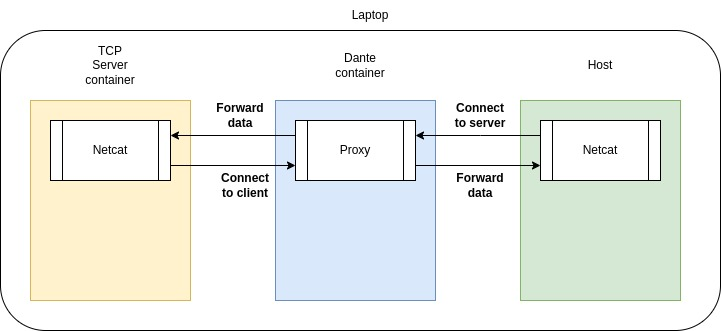
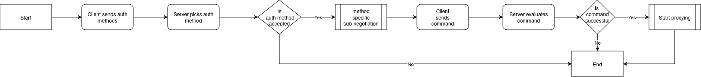

- [Lab 1 - Exploring the protocol](#lab-1---exploring-the-protocol)
    * [Overview](#overview)
    * [Tooling](#tooling)
    * [Concepts](#concepts)
        + [SOCKS5 commands](#socks5-commands)
        + [SOCKS5 connection flow](#socks5-connection-flow)
        + [SOCKS5 messages formats](#socks5-messages-formats)
    * [Experiments](#experiments)
        + [Prerequisites](#prerequisites)
    * [Exploring the CONNECT command](#exploring-the-connect-command)
        + [Setting up mock TCP server](#setting-up-mock-tcp-server)
        + [Connecting to the TCP server via netcat and wirez](#connecting-to-the-tcp-server-via-netcat-and-wirez)
        + [Analyzing the traffic](#analyzing-the-traffic)
    * [Exploring the BIND command](#exploring-the-bind-command)
        + [Setting up mock TCP Server](#setting-up-mock-tcp-server)
        + [Connecting to the TCP server via netcat and socat - issuing CONNECT command](#connecting-to-the-tcp-server-via-netcat-and-socat---issuing-connect-command)
        + [Connecting from the TCP server to the client via the proxy - issuing BIND command](#connecting-from-the-tcp-server-to-the-client-via-the-proxy---issuing-bind-command)
        + [Connecting from the mock TCP server to the client via the proxy](#connecting-from-the-mock-tcp-server-to-the-client-via-the-proxy)
        + [Analyzing the traffic](#analyzing-the-traffic-1)
    * [Exploring the UDP_ASSOCIATE command](#exploring-the-udp-associate-command)
        + [Setting up mock UDP server](#setting-up-mock-udp-server)
        + [Connecting to the mock UDP server via wirez and netcat](#connecting-to-the-mock-udp-server-via-wirez-and-netcat)
        + [Analyzing the traffic](#analyzing-the-traffic-2)
- [Conclusion](#conclusion)
    * [Observed messages](#observed-messages)
      * [Client - Available authentication methods](#client---available-authentication-methods)
      * [Server - Picking authentication method](#server---picking-authentication-method)
      * [Commands - Request](#commands---request)
      * [Commands - Response](#commands---response)
      * [Encapsulation for UDP datagram](#encapsulation-for-udp-datagram)

<small><i><a href='http://ecotrust-canada.github.io/markdown-toc/'>Table of contents generated with markdown-toc</a></i></small>

# Lab 1 - Exploring the protocol
## Overview
The goal of this exercise is to explore the protocol by monitoring the network traffic from client, through proxy server and to mocked TCP/UDP server. In the end we will have a series of pcaps outlining the different SOCKS5 commands. Authentication and traffic rules i.e. the proxy server allowing/denying certain requests is out of scope.

The network setup matches the following diagram:

Connect and UDP associate commands:



Bind command:


## Tooling
1.  [Wirez](https://github.com/v-byte-cpu/wirez) is a tool for
    redirecting TCP and UDP traffic to SOCKS5 proxy. It is written in
    Golang. It supports the `CONNECT` and `UDP ASSOCIATE` commands
2.  [Socat](https://linux.die.net/man/1/socat) is a tool for relaying
    information between two bidirectional byte streams. It supports the
    `BIND` command
3.  [Wireshark](https://www.wireshark.org/) is tool for capturing and
    analyzing network traffic.
4.  [Dante](https://www.inet.no/dante/) is a free SOCKS5 server
5.  [netcat](https://linux.die.net/man/1/nc) is tool for working with
    TCP and UDP connections.

## Concepts
### SOCKS5 commands
In [RFC1928](https://datatracker.ietf.org/doc/html/rfc1928), the
following commands are outlined:

-   CONNECT - This is the basic forwarding of TCP segments from the
    client to the server.
-   BIND - The BIND command is used in scenarios, where the server will
    attempt to connect back to the client. A typical usage of BIND is
    for P2P network protocols or
    [FTP](https://stackoverflow.com/questions/25092819/when-should-an-ftp-server-connect-to-ftp-client-after-port-command).
    The `BIND` command is sent after `CONNECT` command
-   UDP~ASSOCIATE~ - The proxy is relaying UDP datagrams to server and
    the responses from the server are relayed back to the client. The
    connection is started via TCP, but later on the proxy server must
    offer a UDP listener, on which datagrams with specific format are
    being sent.

### SOCKS5 connection flow

In [RFC1928](https://datatracker.ietf.org/doc/html/rfc1928), the
connection flow is outlined as follows:

1.  The `client` sends a message containing the available authentication
    methods
2.  The `server` picks authentication method, or returns
    `NO ACCEPTED METHODS`
3.  If the response is `NO ACCEPTED METHODS` the `client` terminates the
    connection
4.  If the response contains a desired authentication method, the
    `client` and the `server` enter a method-dependent sub-negotiation
5.  Once the authentication is completed, the `client` sends a command -
    either `CONNECT`, `BIND` or `UDP ASSOCIATE`
6.  The server evaluates the requests and returns a response, either
    indicating success or failure.
7.  In case of success, the proxying starts.



### SOCKS5 messages formats

The messages of SOCKS5 can be roughly divided in `requests` and
`responses`. Every message starts with a field called `VER`, which in
SOCKS5 is always the value of 5 (or 0x05). At the end of this lab, we
will have an example of each message which the protocol provides.
[RFC1928](https://datatracker.ietf.org/doc/html/rfc1928) provides some
examples.


## Experiments
### Prerequisites
1. Compiling wirez

    As [Wirez](https://github.com/v-byte-cpu/wirez) doesn't provide
    ready to use binary, we must compile it. The instructions below are
    for Linux. You can compile the program by following the instructions
    in the repository.

    1.  Install go 1.20
    ``` bash
    $ go install golang.org/dl/go1.20.9@latest
    $ go1.20.9 download
    ```

   2. Clone the repository
    ``` bash
    $ git clone https://github.com/v-byte-cpu/wirez.git
    ```

   3. Compile
    ``` bash
    $ cd wirez
    $ go build
    ```

2. Starting Dante on local machine with Docker

    Running [Dante](https://www.inet.no/dante/) locally with Docker is a
    convenient way, as the setup doesn't focus on the specifics of the
    proxy server.

    1.  [Install docker](https://docs.docker.com/engine/install/)
    2.  Pull the following image: `wernight/dante`
    3.  To start the container and bind port `1080` to it run
        `docker run -p 1080:1080 wernight/dante`
    4.  If everything was successful so far, you must have the following
        log line:

    ```
    Jan 24 19:42:40 (1737747760.895891) sockd[7]: info: Dante/server[1/1] v1.4.2 running
    ```
3. Installing other tools

The rest of the tooling (`netcat`, `socat`, and `Wireshark`) is
widely available, consult official guidelines for your platform.

## Exploring the CONNECT command
### Setting up mock TCP server
The following command can be used to start a mock TCP server on port 8888:
```bash
$ nc -l 8888
```
### Connecting to the TCP server via netcat and wirez
We can connect to the server from the previous point using the following command:
```bash
$ ./wirez run -F PROXY_IP:PROXY_PORT -- nc SERVER_IP SERVER_PORT
# Example: ./wirez run -F 127.0.0.1:1080 -- nc 148.113.191.22 8888
```
### Analyzing the traffic
1. Message send from the client on connection initialization
```
Transmission Control Protocol, Src Port: 43992, Dst Port: 1080, Seq: 1, Ack: 1, Len: 3
Socks Protocol
    Version: 5
    Client Authentication Methods
        Authentication Method Count: 1
        Method[0]: 0 (No authentication) 
```
2. Message send from the server picking an auth method
```
Transmission Control Protocol, Src Port: 43992, Dst Port: 1080, Seq: 1, Ack: 1, Len: 3
Socks Protocol
    Version: 5
    Accepted Auth Method: 0x0 (No authentication)
```
3. Client requesting connect command
```
Transmission Control Protocol, Src Port: 43992, Dst Port: 1080, Seq: 4, Ack: 3, Len: 10
Socks Protocol
    Version: 5
    Command: Connect (1)
    Reserved: 0
    Address Type: IPv4 (1)
    Remote Address: 148.113.191.22
    Port: 8888
```
4. Server responding to CONNECT command
```
Transmission Control Protocol, Src Port: 1080, Dst Port: 43992, Seq: 3, Ack: 14, Len: 10
Socks Protocol
    Version: 5
    Results(V5): Succeeded (0)
    Reserved: 0
    Address Type: IPv4 (1)
    Remote Address: 172.17.0.2
    Port: 43992
```
5. Client opening connection to server via proxy

**NOTE: The format below are not purposely encapsulated, like the UDP ones. That is we don’t need to implement them as custom messages**
```
Transmission Control Protocol, Src Port: 43992, Dst Port: 1080, Seq: 14, Ack: 13, Len: 1
Socks Protocol
    [Version: 5]
    [Command: Connect (1)]
    [Remote Address: 148.113.191.22]
    [Remote Port: 8888]
    TCP payload (1 byte)
Data (1 byte)

0000  0a                                                .
    Data: 0a
    [Length: 1]
```
6. Client sending data to server via proxy
```
Transmission Control Protocol, Src Port: 43992, Dst Port: 1080, Seq: 15, Ack: 13, Len: 5
Socks Protocol
    [Version: 5]
    [Command: Connect (1)]
    [Remote Address: 148.113.191.22]
    [Remote Port: 8888]
    TCP payload (5 bytes)
Data (5 bytes)

0000  74 65 73 74 0a                                    test.
    Data: 746573740a
    [Length: 5]
```
7. Proxy server sending response from server to client
```
Transmission Control Protocol, Src Port: 1080, Dst Port: 43992, Seq: 13, Ack: 20, Len: 5
Socks Protocol
    [Version: 5]
    [Command: Connect (1)]
    [Remote Address: 148.113.191.22]
    [Remote Port: 8888]
    TCP payload (5 bytes)
Data (5 bytes)

0000  74 65 73 74 0a                                    test.
    Data: 746573740a
    [Length: 5]
```

## Exploring the BIND command
### Setting up mock TCP Server
```bash
$ docker run -it --entrypoint=/bin/sh subfuzion/netcat
$ nc -l 8888
```
### Connecting to the TCP server via netcat and socat - issuing CONNECT command
```
$ # Get TCP server IP
$ IP=`docker inspect -f '{{range .NetworkSettings.Networks}}{{.IPAddress}}{{end}}' $(docker ps -q -f "ancestor=subfuzion/netcat")`
$ socat --experimental - SOCKS5:127.0.0.1:1080:"$IP":8888
```
### Connecting from the TCP server to the client via the proxy - issuing BIND command
```bash
$ # Get TCP server IP
$ IP=`docker inspect -f '{{range .NetworkSettings.Networks}}{{.IPAddress}}{{end}}' $(docker ps -q -f "ancestor=subfuzion/netcat")`
$ socat --experimental - SOCKS5-LISTEN:127.0.0.1:1080:"$IP":8888
```
### Connecting from the mock TCP server to the client via the proxy
```bash
$ CONTAINER_ID=`docker ps -q -f "ancestor=subfuzion/netcat"`
$ docker exec -it "$CONTAINER_ID" sh
$ nc PROXY_IP PROXY_PORT_FROM_BIND_RESPONSE
```
**note: the PROXY_PORT_FROM_BIND_RESPONSE is obtained from analyzing the response with Wireshark**
### Analyzing the traffic

**notes:**

**1. The messages which overlap with the `CONNECT` command are omitted here**

**2. It appears that the data proxied from the server, to the client (i.e. data send to the binded port) is not encapsulated in protocol-specific message**

1. Bind Request
```
   Transmission Control Protocol, Src Port: 1080, Dst Port: 40264, Seq: 3, Ack: 14, Len: 10
   Socks Protocol
   Version: 5
   Results(V5): Succeeded (0)
   Reserved: 0
   Address Type: IPv4 (1)
   Remote Address: 172.17.0.2
   Port: 59073
```
2. Bind response
```
   Transmission Control Protocol, Src Port: 1080, Dst Port: 40264, Seq: 13, Ack: 14, Len: 10
   Socks Protocol
   Version: 5
   Results(V5): Succeeded (0)
   Reserved: 0
   Address Type: IPv4 (1)
   Remote Address: 172.17.0.3
   Remote Host Port: 57608
```
## Exploring the UDP_ASSOCIATE command
### Setting up mock UDP server
```bash
$ nc -lu 8888
```
### Connecting to the mock UDP server via wirez and netcat
```bash
$ ./wirez run -F 127.0.0.1:1080 -- nc -u 148.113.191.22 8888
```
### Analyzing the traffic
**Note: The UDP request to the server doesn’t contain any socks5 specific encapsulation**
1. UDP_ASSOCIATE command request
```
Transmission Control Protocol, Src Port: 39302, Dst Port: 1080, Seq: 4, Ack: 3, Len: 10
Socks Protocol
    Version: 5
    Command: UdpAssociate (3)
    Reserved: 0
    Address Type: IPv4 (1)
    Remote Address: 0.0.0.0
    Port: 0
```
2. UDP_ASSOCIATE command response
```
Transmission Control Protocol, Src Port: 1080, Dst Port: 39302, Seq: 3, Ack: 14, Len: 10
Socks Protocol
    Version: 5
    Results(V5): Succeeded (0)
    Reserved: 0
    Address Type: IPv4 (1)
    Remote Address: 172.17.0.2
    Port: 36277
```
3. Transfer from client to server via proxy
```
User Datagram Protocol, Src Port: 33010, Dst Port: 36277
Data (15 bytes)

0000  00 00 00 01 94 71 bf 16 22 b8 74 65 73 74 0a      .....q..".test.
    Data: 000000019471bf1622b8746573740a
    [Length: 15]
```
4. Transfering server response to client via proxy
```
User Datagram Protocol, Src Port: 36277, Dst Port: 33010
Data (15 bytes)

0000  00 00 00 01 94 71 bf 16 22 b8 74 65 73 74 0a      .....q..".test.
    Data: 000000019471bf1622b8746573740a
    [Length: 15]
```
# Conclusion
## Observed messages
During the experiments the following messages were observed:
##### Client - Available authentication methods
```
+----+----------+----------+
|VER | NMETHODS | METHODS  |
+----+----------+----------+
| 1  |    1     | 1 to 255 |
+----+----------+----------+
```
##### Server - Picking authentication method
```
+----+--------+
|VER | METHOD |
+----+--------+
| 1  |   1    |
+----+--------+
```
##### Commands - Request
```
+----+-----+-------+------+----------+----------+
|VER | CMD |  RSV  | ATYP | DST.ADDR | DST.PORT |
+----+-----+-------+------+----------+----------+
| 1  |  1  | X'00' |  1   | Variable |    2     |
+----+-----+-------+------+----------+----------+
```
##### Commands - Response
```
+----+-----+-------+------+----------+----------+
|VER | REP |  RSV  | ATYP | BND.ADDR | BND.PORT |
+----+-----+-------+------+----------+----------+
| 1  |  1  | X'00' |  1   | Variable |    2     |
+----+-----+-------+------+----------+----------+
```
##### Encapsulation for UDP datagram
```
+----+------+------+----------+----------+----------+
|RSV | FRAG | ATYP | DST.ADDR | DST.PORT |   DATA   |
+----+------+------+----------+----------+----------+
| 2  |  1   |  1   | Variable |    2     | Variable |
+----+------+------+----------+----------+----------+
```
