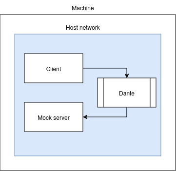

- [Lab 3 - Implementing SOCKS5 Client CONNECT Command](#lab-3---implementing-socks5-client-connect-command)
    * [Overview](#overview)
    * [Experiments](#experiments)
        + [Prerequisites](#prerequisites)
            - [Network setup](#network-setup)
            - [Starting Dante in host network](#starting-dante-in-host-network)
        + [Implementing client states](#implementing-client-states)
        + [Handling authentication](#handling-authentication)
        + [Handling Connect command](#handling-connect-command)
        + [Sending and receiving data via the proxy server](#sending-and-receiving-data-via-the-proxy-server)
        + [Test(stitching all the functionality above)](#test-stitching-all-the-functionality-above-)

<small><i><a href='http://ecotrust-canada.github.io/markdown-toc/'>Table of contents generated with markdown-toc</a></i></small>

# Lab 3 - Implementing SOCKS5 Client CONNECT Command
## Overview
The goal here is to implement a client using the `messages` developed in Lab 2, which will connect to Dante and send request to mock TCP server(via the proxy server). Authentication will not be included.
## Experiments
### Prerequisites
#### Network setup

#### Starting Dante in host network
1. Create new config, look at dante_conf_host_network.conf for example
2. Start the docker container
```bash
$ docker run --net=host -v $(pwd)/dante_conf_host_network.conf:/etc/sockd.conf  wernight/dante
```
### Implementing client states
The states go from smaller to larger, that is you cannot go back from `Authenticated` back to `PendingAuthMethods`.

```go
const (
	PendingAuthMethods          ConnectionState = iota
	ExpectingAcceptedAuthMethod ConnectionState = iota
	PendingAuthentication       ConnectionState = iota
	Authenticated               ConnectionState = iota
	CommandRequested            ConnectionState = iota
	CommandAccepted             ConnectionState = iota
	Closed                      ConnectionState = iota
	Errored                     ConnectionState = iota
)
// State must be private, to control the flow and prevent going back to previous state. Because of this, we need this simple getter
func (client *Socks5Client) State() ConnectionState {
    return client.state
}
// Change the state of a client, it validates that the transition is valid. This mean it checks if the new state is higher than the current state.
func (client *Socks5Client) setState(newState ConnectionState) error {
    if client.state > newState {
        return errors.New(fmt.Sprintf("cannot transition from %v to %v", client.state, newState))
    }
    client.state = newState
    return nil
}
// Helper function for handling errors. The function sets the client to the proper state as well as setting the error.
func (client *Socks5Client) setError(err error) {
    client.err = err
    client.state = Errored
}
```
### Handling authentication
```go
// Basically it send the available auth types to the server. 
// Example usage: err = client.Connect([]uint16{shared.NoAuthRequired})
// The server is not required to accept the auth methods the client support. If the client doesn't support Password authentication, the server can refuse the request.
func (client *Socks5Client) Connect(authMethods []uint16) error {
    // Prepare message
        aam := available_auth_methods.AvailableAuthMethods{}

	if err := aam.AddMultipleMethods(authMethods); err != nil {
		client.setError(err)
		return err
	}
    // Send message
	_, err := client.tcpConn.Write(aam.ToBytes())
	if err != nil {
		client.setError(err)
		return err
	}
	client.setState(ExpectingAcceptedAuthMethod)
    // Read response back
	return client.handleAuth()
}
// Inspect the response from the server and handle the rest of authentication, as we don't plan on using any auth mechanism the function simply checks if the server accepts anonymous clients.
func (client *Socks5Client) handleAuth() error {
    // Make sure we are in correct state
	if client.state != ExpectingAcceptedAuthMethod {
		return errors.New("client is not expecting accepted auth clients")
	}
    // Read data from proxy server and deserialize to message
	buf := make([]byte, 64)
	_, err := client.tcpConn.Read(buf)
	if err != nil {
		client.setError(err)
		return err
	}
	acceptedMethod := accept_auth_method.AcceptAuthMethod{}
	if err := acceptedMethod.Deserialize(buf); err != nil {
		client.setError(err)
		return err
	}
    // Confirm that the server doesn't require authentication, as that is the only thing we support so far.
	if acceptedMethod.Method() != shared.NoAuthRequired {
		return client.setState(PendingAuthentication)
	}
    // Change state to authenticated (happens if all went ok until this point, otherwise the state won't be changed, ~we must have returned earlier!~)
	return client.setState(Authenticated)
}
```

### Handling Connect command
```go
func (client *Socks5Client) ConnectRequest(addr string, port uint16) (string, uint16, error) {
	if client.state != Authenticated {
		return "", 0, errors.New("client is not authenticated")
	}
	commandRequest := command_request.CommandRequest{}
	commandRequest.CMD = shared.CONNECT
	commandRequest.DST_ADDR = shared.DstAddr{Value: addr, Type: shared.ATYP_IPV4}
	commandRequest.DST_PORT = port
	req, err := commandRequest.ToBytes()

	if err != nil {
		return "", 0, err
	}
	_, err = client.tcpConn.Write(req)
	if err != nil {
		client.setError(err)
		return "", 0, err
	}
	client.setState(CommandRequested)
	addrProxy, portProxy, err := client.handleCommandResponse()
	if err != nil {
		client.setError(err)
		return "", 0, err
	}
	return addrProxy, portProxy, nil
}

func (client *Socks5Client) handleCommandResponse() (string, uint16, error) {
	if client.State() != CommandRequested {
		return "", 0, errors.New("client has not requested command") 
	}
	commandResponse, err := waitForServerCommandResponse(client.tcpConn)
	if err != nil {
		client.setError(err)
		return "", 0, err
	}
	if err := isCommandSuccessful(commandResponse); err != nil {
		client.setError(err)
		return "", 0, err
	}

	client.setState(CommandAccepted)
	return commandResponse.BND_ADDR.Value, commandResponse.BND_PORT, nil
}

func isCommandSuccessful(cmd *command_response.CommandResponse) error {
	if cmd.Status != command_response.Success {
		errMsg := fmt.Sprintf("server didn't respond with success, response with %v", cmd.Status)
		return errors.New(errMsg)
	}
	return nil
}

func waitForServerCommandResponse(client net.Conn) (*command_response.CommandResponse, error) {
	buf := make([]byte, 64)
	_, err := client.Read(buf)
	if err != nil {
		return nil, err
	}

	commandResponse := command_response.CommandResponse{}
	err = commandResponse.Deserialize(buf)
	if err != nil {
		return nil, err
	}
	return &commandResponse, nil
}
```

### Sending and receiving data via the proxy server
```go
func (client *Socks5Client) GetReaderWriter() (io.ReadWriter, error) {
	if client.state != CommandAccepted {
		return nil, errors.New("the server has not accepted any command")
	}
	return client.tcpConn, nil
}

func (client *Socks5Client) Close() error {
	client.setState(Closed)
	return client.tcpConn.Close()
}
```
### Mock server
```go
// basic tcp echo server you send "test" you receive "test" back
func TcpEchoServer() (string, uint16) {
	srv, err := net.Listen("tcp4", "127.0.0.1:0")
	if err != nil {
		panic(err)
	}

	go func() {
		client, err := srv.Accept()
		if err != nil {
			panic(err)
		}
		buf := make([]byte, 1024)
		n, err := client.Read(buf)
		if err != nil {
			panic(err)
		}
		client.Write(buf[:n])
		client.Close()
	}()
	addr := srv.Addr().(*net.TCPAddr).IP.String()
	port := srv.Addr().(*net.TCPAddr).Port
	return addr, uint16(port)
}
```
### Test(stitching all the functionality above)
```go
func Test_Client_Connect(t *testing.T) {
	ctx, _ := context.WithTimeout(context.Background(), time.Second*5)
	addr, port := sockstests.TcpEchoServer() 
	client, err := NewSocks5Client(ctx, "127.0.0.1:1080")
	if err != nil {
		t.Fatal("Failed connecting to Dante")
	}
	// authenticate
	err = client.Connect([]uint16{shared.NoAuthRequired})
	if err != nil {
		t.Fatalf("Failed sending authentication request. Reason %v", err)
	}
	if client.State() != Authenticated {
		t.Fatalf("Failed authentication")
	}
	// send connect request
	_, _, err = client.ConnectRequest(addr, port)
	if err != nil {
		t.Fatalf("Failed sending connect request to Dante. Reason %v", err)
	}
	if client.State() != CommandAccepted {
		t.Fatalf("Failed sending connect request to Dante")
	}
	// send and receive data
	rw, err := client.GetReaderWriter()
	if err != nil {
		t.Fatalf("%v", err)
	}
	testString := "Hello"
	_, err = rw.Write([]byte(testString))
	if err != nil {
		t.Fatalf("Failed writing to mock server, reason: %v", err)
	}

	buf := make([]byte, 1024)
	n, err := rw.Read(buf)
	if err != nil {
		t.Fatalf("Failed reading from mock server, reason: %v", err)
	}
	if string(buf[:n]) != testString {
		t.Fatalf("Expected '%s', got '%s'", testString, string(buf[:n]))
	}
	client.Close()
}
```