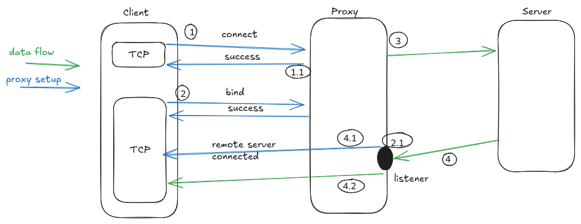

- [Lab 4 - Implementing SOCKS5 Client BIND Command](#lab-4---implementing-socks5-client-bind-command)
    * [Overview](#overview)
    * [Concepts](#concepts)
        + [Connection setup and traffic flow](#connection-setup-and-traffic-flow)
    * [Experiments](#experiments)
        + [Prerequisites](#prerequisites)
        + [Handling Bind command](#handling-bind-command)
        + [Mock server](#mock-server)
        + [Test](#test)

<small><i><a href='http://ecotrust-canada.github.io/markdown-toc/'>Table of contents generated with markdown-toc</a></i></small>

# Lab 4 - Implementing SOCKS5 Client BIND Command
## Overview
In this lab the client will be extended to support the BIND command
## Concepts
### Connection setup and traffic flow
The connect command requires the server to establish connection back to the client. The flow is as follows:

1. The client opens sends a `CONNECT` command to the proxy server.       
1.1. The proxy server establishes TCP connection to the server and returns SUCCESS to the client
2. In a separated TCP connection the client sends a BIND command to the server       
2.1 The proxy server starts a listener and returns the info to the client
3. The client sends the information about the listener from point 2.2 to the server
4. The server establishes connection to the proxy server    
4.1 The proxy server notifies the client that a connection to the listener was established   
4.2 The proxy server transfers the data(send by the server) to the client


## Experiments
### Prerequisites
Same network setup as lab 3

### Handling Bind command

```go
func (client *Socks5Client) BindRequest(addr string, port uint16) (string, uint16, error) {
	if client.state != Authenticated {
		return "", 0, errors.New("client is not authenticated")
	}
	commandRequest := command_request.CommandRequest{}
	commandRequest.CMD = shared.BIND
	commandRequest.DST_ADDR = shared.DstAddr{Value: addr, Type: shared.ATYP_IPV4}
	commandRequest.DST_PORT = port
	req, err := commandRequest.ToBytes()

	if err != nil {
		return "", 0, err
	}
	_, err = client.tcpConn.Write(req)
	if err != nil {
		client.setError(err)
		return "", 0, err
	}

	client.setState(CommandRequested)
	addrProxy, portProxy, err := client.handleCommandResponse()
	if err != nil {
		client.setError(err)
		return "", 0, err
	}
	client.setState(CommandAccepted)
	return addrProxy, portProxy, err
}


// NOTE: Those are the same as the ones for connect command. Added for completeness
// ^^^^
// ^^^^
func (client *Socks5Client) handleCommandResponse() (string, uint16, error) {
	if client.State() != CommandRequested {
		return "", 0, errors.New("client is has not requested command")
	}
	commandResponse, err := waitForServerCommandResponse(client.tcpConn)
	if err != nil {
		client.setError(err)
		return "", 0, err
	}
	if err := isCommandSuccessful(commandResponse); err != nil {
		client.setError(err)
		return "", 0, err
	}

	client.setState(CommandAccepted)
	return commandResponse.BND_ADDR.Value, commandResponse.BND_PORT, nil
}

func isCommandSuccessful(cmd *command_response.CommandResponse) error {
	if cmd.Status != command_response.Success {
		errMsg := fmt.Sprintf("server didn't respond with success, responed with %v", cmd.Status)
		return errors.New(errMsg)
	}
	return nil
}
```
### Mock server
```go
func startServer() net.Addr {
	srv, err := net.Listen("tcp4", "127.0.0.1:4440")
	if err != nil {
		panic(err)
	}

	go func() {
		client, err := srv.Accept()
		if err != nil {
			panic(err)
		}
		buf := make([]byte, 1024)
		n, err := client.Read(buf)
		if err != nil {
			panic(err)
		}
		conn, err := connectBackToClient(string(buf[:n]))
		if err != nil {
			panic(err)
		}
		client.Write([]byte(serverRequestResponse)) // Send to the client-initated connection
		conn.Write([]byte(serverResponse))  // Send to the server-initiated connection 
		conn.Close()
		client.Close()
	}()
	return srv.Addr()
}

func connectBackToClient(addr string) (*net.TCPConn, error) {
	tcpAddr, err := net.ResolveTCPAddr("tcp", addr)
	if err != nil {
		return nil, err
	}
	conn, err := net.DialTCP("tcp", nil, tcpAddr)
	if err != nil {
		return nil, err
	}
	serverConnectedWithPort = uint16(conn.LocalAddr().(*net.TCPAddr).Port)
	return conn, nil
}
```

### Test
```go
const serverRequestResponse = "OK"
const serverResponse = "TEST"


func Test_Client_Bind(t *testing.T) {
	ctx, _ := context.WithTimeout(context.Background(), time.Second*60)
	var serverConnectedWithPort uint16 // this variable is altered by the BindServer to indicate which local port is being used for the server->proxy->client connection
	addr, port := sockstests.BindServer(serverRequestResponse, serverResponse, &serverConnectedWithPort)

	connectClient := openConnectCmd(ctx, addr, port)
	// auth
	bindClient, err := NewSocks5Client(ctx, "127.0.0.1:1080")

	err = bindClient.Connect([]uint16{shared.NoAuthRequired})
	if err != nil {
		t.Fatalf("Failed sending authentication request. Reason %v", err)
	}
	if bindClient.State() != Authenticated {
		t.Fatalf("Failed authentication")
	}
	// send bind command
	addrProxy, portProxy, err := bindClient.BindRequest(addr, uint16(port))
	if err != nil {
		t.Fatalf("Failed sending bind request to Dante. Reason %v", err)
	}
	// Send proxy address to server, so that the server can open connection to it
	// and transmit data back to the client. This is sent via the TCP session from the CONNECT command
	rwConn, err := connectClient.GetReaderWriter()
	rwConn.Write([]byte(addrProxy + ":" + strconv.Itoa(int(portProxy))))
	buf := make([]byte, 1024)
	n, err := rwConn.Read(buf)
	if string(buf[:n]) != serverRequestResponse {
		t.Fatalf("Expected server to response with %v", serverRequestResponse)
	}
	// wait for server to connect to proxy and read data
	rwBind, err := bindClient.GetReaderWriter()
	// Once the server established connection with the proxy server, before sending the data, the proxy server sends information about the connection
	buf2 := make([]byte, 1024)
	n, err = rwBind.Read(buf2)
	msg := command_response.CommandResponse{}
	msg.Deserialize(buf2[:n])
	if msg.BND_PORT != serverConnectedWithPort {
		t.Fatalf("Expected port send by the proxy server: %v, expected: %v", msg.BND_PORT, serverConnectedWithPort)
	}
	if msg.BND_ADDR.Value != "127.0.0.1" {
		t.Fatalf("Expected IP end by the proxy server: %v, expected: 127.0.0.1", msg.BND_PORT)
	}
	// Read actual data
	//// NOTE: Sometimes, the response from the successful connection and the data its self come in the same read operation
	//// Because there is no way to differentiate between them specified in the RFC, the simplest yet reliable way I found is to check if
	//// the message was the whole buffer, if not then at least part of the data arrived with the socks5 message.
	respLength, _ := msg.ToBytes()
	if n > len(respLength) {
		if string(buf2[len(respLength):n]) != serverResponse {
			t.Fatalf("Expected server to send with TEST, got %v", string(buf2[len(respLength):n]))
		}
		return
	}
	n, err = rwBind.Read(buf2)
	if string(buf2[:n]) != serverResponse {
		t.Fatalf("Expected server to send with TEST, got %v", string(buf2[:n]))
	}
}

func openConnectCmd(ctx context.Context, addr string, port uint16) *Socks5Client {
	client, err := NewSocks5Client(ctx, "127.0.0.1:1080")
	if err != nil {
		panic(err)
	}
	err = client.Connect([]uint16{shared.NoAuthRequired})
	if err != nil {
		panic(err)
	}
	_, _, err = client.ConnectRequest(addr, port)
	if err != nil {
		panic(err)
	}
	return client
}
```